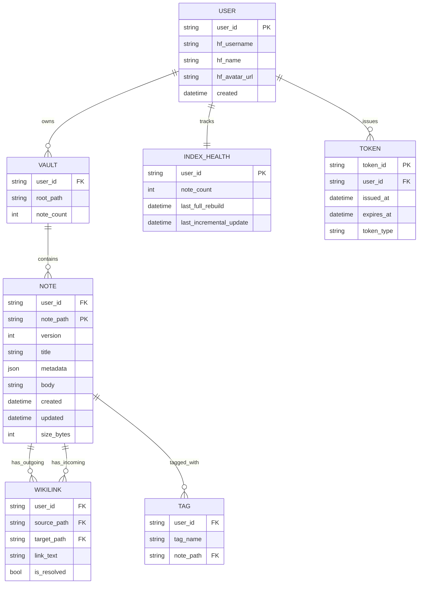
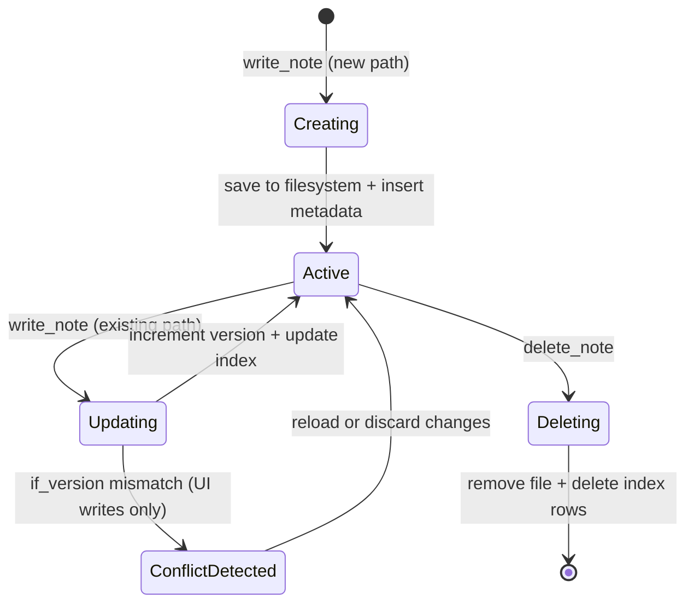
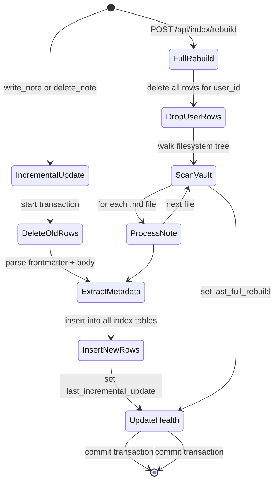

# Data Model: Multi-Tenant Obsidian-Like Docs Viewer

**Feature Branch**: `001-obsidian-docs-viewer`
**Created**: 2025-11-15
**Status**: Draft

## Table of Contents

1. [Overview](#overview)
2. [Entity Relationship Diagram](#entity-relationship-diagram)
3. [Core Entities](#core-entities)
4. [Index Entities](#index-entities)
5. [Authentication Entities](#authentication-entities)
6. [SQLite Schema](#sqlite-schema)
7. [Pydantic Models](#pydantic-models)
8. [TypeScript Type Definitions](#typescript-type-definitions)
9. [Validation Rules](#validation-rules)
10. [State Transitions](#state-transitions)
11. [Relationships and Constraints](#relationships-and-constraints)

---

## Overview

This document defines the complete data model for a multi-tenant Obsidian-like documentation viewer. The system stores:

- **User accounts** with HF OAuth identity mapping
- **Vaults** as per-user directory trees containing Markdown notes
- **Notes** with YAML frontmatter, version tracking, and full-text indexing
- **Wikilinks** for bidirectional linking between notes
- **Tags** for categorization and filtering
- **Index metadata** for search optimization and health monitoring

**Design principles**:
- **Per-user isolation**: All data scoped by `user_id`
- **Filesystem-backed**: Notes stored as `.md` files, metadata in SQLite
- **Version-controlled**: Integer version counter for optimistic concurrency
- **Search-optimized**: SQLite FTS5 for full-text search, separate indexes for tags and links

---

## Entity Relationship Diagram



**Key relationships**:
- One user owns one vault (1:1)
- One vault contains many notes (1:N)
- One note has many outgoing wikilinks (1:N)
- One note may be referenced by many backlinks (1:N)
- One note can have many tags (N:M via junction table)
- One user has one index health record (1:1)
- One user can issue many tokens (1:N)

---

## Core Entities

### User

Represents an authenticated user with HF OAuth identity.

**Attributes**:
- `user_id` (string, PK): Internal unique identifier, derived from HF username or UUID
- `hf_username` (string, nullable): HuggingFace username (e.g., "alice")
- `hf_name` (string, nullable): Display name from HF profile
- `hf_avatar_url` (string, nullable): Profile picture URL
- `created` (datetime): Account creation timestamp (ISO 8601)

**Notes**:
- In local mode, `user_id = "local-dev"` with null HF fields
- In HF Space mode, `user_id = hf_username` (normalized to lowercase)
- `created` timestamp set on first OAuth login (vault initialization)

**Lifecycle**:
1. User authenticates via HF OAuth
2. Backend maps HF identity to `user_id`
3. If new user, create vault directory and initialize index
4. Return user info to frontend

---

### Vault

A per-user directory tree containing Markdown notes.

**Attributes**:
- `user_id` (string, FK): Owner of the vault
- `root_path` (string): Absolute filesystem path to vault root (e.g., `/data/vaults/alice/`)
- `note_count` (int): Cached count of notes in vault (denormalized from index)

**Constraints**:
- Max 5,000 notes per vault (enforced by FR-008)
- Root path must exist and be writable
- Directory structure is arbitrary (user-defined nested folders)

**Filesystem layout example**:
```
/data/vaults/alice/
├── README.md
├── api/
│   ├── design.md
│   └── endpoints.md
├── guides/
│   ├── setup.md
│   └── deployment.md
└── notes/
    └── meeting-2025-01-15.md
```

---

### Note

A Markdown file with optional YAML frontmatter and body content.

**Attributes**:
- `user_id` (string, FK): Owner of the note
- `note_path` (string, PK): Relative path to vault root, includes `.md` (e.g., `api/design.md`)
- `version` (int): Optimistic concurrency version counter (starts at 1, increments on write)
- `title` (string): Display title (from frontmatter, first H1, or filename stem)
- `metadata` (JSON): Frontmatter key-value pairs (excludes auto-managed fields)
- `body` (string): Markdown content (excluding frontmatter)
- `created` (datetime, ISO 8601): Creation timestamp (auto-set if not in frontmatter)
- `updated` (datetime, ISO 8601): Last modification timestamp (auto-set on every write)
- `size_bytes` (int): UTF-8 byte size of full file content (frontmatter + body)

**Constraints**:
- `note_path` max 256 characters, Unix-style separators (`/`), no `..` allowed
- `size_bytes` max 1 MiB (1,048,576 bytes) per FR-007
- `version` stored in index, NOT in frontmatter
- `created` and `updated` stored in index, MAY appear in frontmatter (frontmatter is source of truth on read)

**Title resolution priority** (FR-006):
1. `metadata.get('title')` from frontmatter
2. First `# Heading` in body (H1 only)
3. Filename stem (e.g., `design.md` → "design")

**Metadata fields** (common, but arbitrary):
- `tags` (array of strings): Tag names for categorization
- `project` (string): Project identifier
- `created` (datetime): User-provided creation timestamp
- `updated` (datetime): User-provided update timestamp
- Custom fields allowed (JSON object)

---

## Index Entities

### Wikilink

Represents a bidirectional link between two notes.

**Attributes**:
- `user_id` (string, FK): Owner of the notes
- `source_path` (string, FK): Path of note containing the wikilink
- `target_path` (string, nullable, FK): Resolved path of linked note (null if unresolved)
- `link_text` (string): Original text from `[[link text]]`
- `is_resolved` (bool): True if `target_path` is non-null, false if broken link

**Extraction**:
- Regex pattern: `\[\[([^\]]+)\]\]`
- Extract all matches from note body on every write

**Resolution algorithm** (FR-015, FR-016):
1. Normalize `link_text` to slug: lowercase, replace spaces/underscores with dash, strip non-alphanumeric
2. Match normalized slug against:
   - Normalized filename stems (e.g., `api-design.md` → "api-design")
   - Normalized frontmatter titles (e.g., `title: "API Design"` → "api-design")
3. If multiple matches:
   - Prefer same-folder match (e.g., `api/[[design]]` → `api/design.md` over `guides/design.md`)
   - Tiebreaker: lexicographically smallest path
4. If no match: `target_path = null`, `is_resolved = false`

**Slug normalization function**:
```python
import re

def normalize_slug(text: str) -> str:
    text = text.lower()
    text = re.sub(r'[\s_]+', '-', text)  # Spaces/underscores → dash
    text = re.sub(r'[^a-z0-9-]', '', text)  # Keep alphanumeric + dash
    text = re.sub(r'-+', '-', text)  # Collapse dashes
    return text.strip('-')
```

**Backlinks**:
- To get backlinks for `note_path`, query: `WHERE target_path = note_path`
- Backlinks are automatically updated when any note's wikilinks change

---

### Tag

A metadata label applied to notes for categorization.

**Attributes**:
- `user_id` (string, FK): Owner of the notes
- `note_path` (string, FK): Path of tagged note
- `tag_name` (string): Tag identifier (lowercase, alphanumeric + hyphens)

**Constraints**:
- Many-to-many relationship: one note can have multiple tags, one tag can apply to multiple notes
- Tag names normalized: lowercase, strip whitespace
- Extracted from frontmatter `tags: [tag1, tag2]` array

**Tag count**:
- Computed via `COUNT(DISTINCT note_path) GROUP BY tag_name`
- Used for tag cloud and filtering UI

---

### Index Health

Tracks the state and freshness of per-user indices.

**Attributes**:
- `user_id` (string, PK): Owner of the index
- `note_count` (int): Total number of notes indexed
- `last_full_rebuild` (datetime, nullable, ISO 8601): Timestamp of last full index rebuild
- `last_incremental_update` (datetime, nullable, ISO 8601): Timestamp of last incremental update (write/delete)

**Usage**:
- Displayed in UI as index health indicator
- Used to detect stale indices (e.g., `note_count` mismatch with actual file count)
- Manual rebuild sets `last_full_rebuild = now()` (FR-019)
- Every write/delete sets `last_incremental_update = now()` (FR-018)

---

## Authentication Entities

### Token (JWT)

A signed JSON Web Token used for API and MCP authentication.

**JWT Claims** (payload):
- `sub` (string): Subject (user_id)
- `iat` (int): Issued at timestamp (Unix epoch)
- `exp` (int): Expiration timestamp (Unix epoch, iat + 90 days)

**Header**:
- `alg: "HS256"`: HMAC SHA-256 signature algorithm
- `typ: "JWT"`: Token type

**Signature**:
- Signed with server secret (env var `JWT_SECRET_KEY`)
- Validated on every API/MCP request via `Authorization: Bearer <token>` header

**Token lifecycle**:
1. User authenticates via HF OAuth
2. User calls `POST /api/tokens` to issue JWT
3. Frontend stores token in memory (React context)
4. MCP clients pass token to `auth` parameter (FastMCP HTTP transport)
5. Server validates token on every request, extracts `user_id` from `sub` claim
6. Token expires after 90 days, user must re-authenticate

**Example token**:
```json
{
  "header": {
    "alg": "HS256",
    "typ": "JWT"
  },
  "payload": {
    "sub": "alice",
    "iat": 1736956800,
    "exp": 1744732800
  },
  "signature": "<HMAC-SHA256-signature>"
}
```

Encoded: `eyJhbGciOiJIUzI1NiIsInR5cCI6IkpXVCJ9.eyJzdWIiOiJhbGljZSIsImlhdCI6MTczNjk1NjgwMCwiZXhwIjoxNzQ0NzMyODAwfQ.<signature>`

---

## SQLite Schema

Complete DDL for multi-index storage with per-user isolation.

### Core Tables

#### note_metadata

Stores note metadata for fast lookups and version tracking.

```sql
CREATE TABLE IF NOT EXISTS note_metadata (
    user_id TEXT NOT NULL,
    note_path TEXT NOT NULL,
    version INTEGER NOT NULL DEFAULT 1,
    title TEXT NOT NULL,
    created TEXT NOT NULL,  -- ISO 8601 timestamp
    updated TEXT NOT NULL,  -- ISO 8601 timestamp
    size_bytes INTEGER NOT NULL DEFAULT 0,
    normalized_title_slug TEXT,  -- Pre-computed for wikilink resolution
    normalized_path_slug TEXT,   -- Pre-computed for wikilink resolution
    PRIMARY KEY (user_id, note_path)
);

CREATE INDEX idx_metadata_user ON note_metadata(user_id);
CREATE INDEX idx_metadata_updated ON note_metadata(user_id, updated DESC);
CREATE INDEX idx_metadata_title_slug ON note_metadata(user_id, normalized_title_slug);
CREATE INDEX idx_metadata_path_slug ON note_metadata(user_id, normalized_path_slug);
```

**Notes**:
- Composite primary key: `(user_id, note_path)`
- `version` starts at 1, increments on every write
- `normalized_*_slug` columns enable O(1) wikilink resolution
- Index on `updated DESC` for recency-based sorting

---

#### note_fts

Full-text search index using SQLite FTS5.

```sql
CREATE VIRTUAL TABLE IF NOT EXISTS note_fts USING fts5(
    user_id UNINDEXED,
    note_path UNINDEXED,
    title,
    body,
    content='',  -- Contentless (external content pattern)
    tokenize='porter unicode61',  -- Stemming + Unicode support
    prefix='2 3'  -- Prefix indexes for autocomplete
);
```

**Notes**:
- `content=''` (contentless): We manually INSERT/DELETE rows, no automatic sync
- `UNINDEXED` columns are retrievable but not searchable (used for IDs)
- `porter` tokenizer: English stemming (e.g., "running" matches "run")
- `prefix='2 3'`: Enables fast `MATCH 'prefix*'` queries (2-char and 3-char prefixes)
- Manual row management: On write, `DELETE` old row + `INSERT` new row
- Ranking: Use `bm25(note_fts, 3.0, 1.0)` for title weight=3x, body weight=1x

**Query example**:
```sql
SELECT
    note_path,
    title,
    bm25(note_fts, 3.0, 1.0) AS rank
FROM note_fts
WHERE user_id = ? AND note_fts MATCH ?
ORDER BY rank DESC
LIMIT 50;
```

**Safety**: Incoming queries are tokenized and each token is wrapped in double quotes before being passed to `MATCH`, escaping embedded quotes and preserving trailing `*` for prefix searches. This prevents syntax errors from characters such as apostrophes while keeping simple keyword semantics.

---

#### note_tags

Many-to-many junction table for note-tag relationships.

```sql
CREATE TABLE IF NOT EXISTS note_tags (
    user_id TEXT NOT NULL,
    note_path TEXT NOT NULL,
    tag TEXT NOT NULL,
    PRIMARY KEY (user_id, note_path, tag)
);

CREATE INDEX idx_tags_user_tag ON note_tags(user_id, tag);
CREATE INDEX idx_tags_user_path ON note_tags(user_id, note_path);
```

**Notes**:
- Composite primary key prevents duplicate tag assignments
- Index on `(user_id, tag)` for "all notes with tag X" queries
- Index on `(user_id, note_path)` for "all tags for note Y" queries

**Query examples**:
```sql
-- Get all notes with tag "backend"
SELECT DISTINCT note_path, title
FROM note_tags t
JOIN note_metadata m USING (user_id, note_path)
WHERE t.user_id = ? AND t.tag = ?
ORDER BY m.updated DESC;

-- Get tag counts for user
SELECT tag, COUNT(DISTINCT note_path) as count
FROM note_tags
WHERE user_id = ?
GROUP BY tag
ORDER BY count DESC;
```

---

#### note_links

Stores wikilink graph for backlink navigation.

```sql
CREATE TABLE IF NOT EXISTS note_links (
    user_id TEXT NOT NULL,
    source_path TEXT NOT NULL,
    target_path TEXT,  -- NULL if unresolved
    link_text TEXT NOT NULL,
    is_resolved INTEGER NOT NULL DEFAULT 0,  -- Boolean: 0=broken, 1=resolved
    PRIMARY KEY (user_id, source_path, link_text)
);

CREATE INDEX idx_links_user_source ON note_links(user_id, source_path);
CREATE INDEX idx_links_user_target ON note_links(user_id, target_path);
CREATE INDEX idx_links_unresolved ON note_links(user_id, is_resolved);
```

**Notes**:
- `target_path` is nullable (null = broken link)
- `is_resolved` is integer (0 or 1) for SQLite boolean representation
- Composite primary key prevents duplicate links from same source with same text
- Index on `target_path` enables fast backlink queries

**Query examples**:
```sql
-- Get backlinks for a note
SELECT DISTINCT l.source_path, m.title
FROM note_links l
JOIN note_metadata m ON l.user_id = m.user_id AND l.source_path = m.note_path
WHERE l.user_id = ? AND l.target_path = ?
ORDER BY m.updated DESC;

-- Get all unresolved links for user
SELECT source_path, link_text
FROM note_links
WHERE user_id = ? AND is_resolved = 0;
```

---

#### index_health

Tracks index state and freshness per user.

```sql
CREATE TABLE IF NOT EXISTS index_health (
    user_id TEXT PRIMARY KEY,
    note_count INTEGER NOT NULL DEFAULT 0,
    last_full_rebuild TEXT,  -- ISO 8601 timestamp
    last_incremental_update TEXT  -- ISO 8601 timestamp
);
```

**Notes**:
- One row per user
- `last_full_rebuild` set on manual rebuild (FR-042)
- `last_incremental_update` set on every write/delete (FR-018)
- `note_count` is denormalized cache for quick health checks

---

### Initialization Script

Complete schema initialization:

```sql
-- Enable FTS5 extension (usually built-in)
-- PRAGMA compile_options;  -- Check if FTS5 is available

BEGIN TRANSACTION;

-- Core metadata table
CREATE TABLE IF NOT EXISTS note_metadata (
    user_id TEXT NOT NULL,
    note_path TEXT NOT NULL,
    version INTEGER NOT NULL DEFAULT 1,
    title TEXT NOT NULL,
    created TEXT NOT NULL,
    updated TEXT NOT NULL,
    size_bytes INTEGER NOT NULL DEFAULT 0,
    normalized_title_slug TEXT,
    normalized_path_slug TEXT,
    PRIMARY KEY (user_id, note_path)
);

CREATE INDEX IF NOT EXISTS idx_metadata_user ON note_metadata(user_id);
CREATE INDEX IF NOT EXISTS idx_metadata_updated ON note_metadata(user_id, updated DESC);
CREATE INDEX IF NOT EXISTS idx_metadata_title_slug ON note_metadata(user_id, normalized_title_slug);
CREATE INDEX IF NOT EXISTS idx_metadata_path_slug ON note_metadata(user_id, normalized_path_slug);

-- Full-text search index
CREATE VIRTUAL TABLE IF NOT EXISTS note_fts USING fts5(
    user_id UNINDEXED,
    note_path UNINDEXED,
    title,
    body,
    content='',
    tokenize='porter unicode61',
    prefix='2 3'
);

-- Tag index
CREATE TABLE IF NOT EXISTS note_tags (
    user_id TEXT NOT NULL,
    note_path TEXT NOT NULL,
    tag TEXT NOT NULL,
    PRIMARY KEY (user_id, note_path, tag)
);

CREATE INDEX IF NOT EXISTS idx_tags_user_tag ON note_tags(user_id, tag);
CREATE INDEX IF NOT EXISTS idx_tags_user_path ON note_tags(user_id, note_path);

-- Link graph
CREATE TABLE IF NOT EXISTS note_links (
    user_id TEXT NOT NULL,
    source_path TEXT NOT NULL,
    target_path TEXT,
    link_text TEXT NOT NULL,
    is_resolved INTEGER NOT NULL DEFAULT 0,
    PRIMARY KEY (user_id, source_path, link_text)
);

CREATE INDEX IF NOT EXISTS idx_links_user_source ON note_links(user_id, source_path);
CREATE INDEX IF NOT EXISTS idx_links_user_target ON note_links(user_id, target_path);
CREATE INDEX IF NOT EXISTS idx_links_unresolved ON note_links(user_id, is_resolved);

-- Index health tracking
CREATE TABLE IF NOT EXISTS index_health (
    user_id TEXT PRIMARY KEY,
    note_count INTEGER NOT NULL DEFAULT 0,
    last_full_rebuild TEXT,
    last_incremental_update TEXT
);

COMMIT;
```

---

## Pydantic Models

Python data models using Pydantic for validation and serialization.

### User Models

```python
from pydantic import BaseModel, Field
from datetime import datetime
from typing import Optional


class HFProfile(BaseModel):
    """HuggingFace OAuth profile information."""
    username: str = Field(..., description="HF username")
    name: Optional[str] = Field(None, description="Display name")
    avatar_url: Optional[str] = Field(None, description="Profile picture URL")


class User(BaseModel):
    """User account with authentication info."""
    user_id: str = Field(..., min_length=1, max_length=64, description="Internal user ID")
    hf_profile: Optional[HFProfile] = Field(None, description="HF OAuth profile")
    vault_path: str = Field(..., description="Absolute path to user's vault")
    created: datetime = Field(..., description="Account creation timestamp")

    class Config:
        json_schema_extra = {
            "example": {
                "user_id": "alice",
                "hf_profile": {
                    "username": "alice",
                    "name": "Alice Smith",
                    "avatar_url": "https://cdn-avatars.huggingface.co/v1/alice"
                },
                "vault_path": "/data/vaults/alice",
                "created": "2025-01-15T10:30:00Z"
            }
        }
```

---

### Note Models

```python
from pathlib import Path
import re


class NoteMetadata(BaseModel):
    """Frontmatter metadata (arbitrary key-value pairs)."""
    title: Optional[str] = None
    tags: Optional[list[str]] = None
    project: Optional[str] = None
    created: Optional[datetime] = None
    updated: Optional[datetime] = None

    class Config:
        extra = "allow"  # Allow arbitrary fields


class Note(BaseModel):
    """Complete note with content and metadata."""
    user_id: str = Field(..., description="Owner user ID")
    note_path: str = Field(
        ...,
        min_length=1,
        max_length=256,
        description="Relative path to vault root (includes .md)"
    )
    version: int = Field(..., ge=1, description="Optimistic concurrency version")
    title: str = Field(..., min_length=1, description="Display title")
    metadata: NoteMetadata = Field(default_factory=NoteMetadata, description="Frontmatter")
    body: str = Field(..., description="Markdown content")
    created: datetime = Field(..., description="Creation timestamp")
    updated: datetime = Field(..., description="Last update timestamp")
    size_bytes: int = Field(..., ge=0, le=1_048_576, description="File size in bytes")

    @validator("note_path")
    def validate_path(cls, v):
        """Validate note path format."""
        # Must end with .md
        if not v.endswith('.md'):
            raise ValueError("Note path must end with .md")

        # Must not contain ..
        if '..' in v:
            raise ValueError("Note path must not contain '..'")

        # Must use Unix-style separators
        if '\\' in v:
            raise ValueError("Note path must use Unix-style separators (/)")

        # Must not start with /
        if v.startswith('/'):
            raise ValueError("Note path must be relative (no leading /)")

        return v

    class Config:
        json_schema_extra = {
            "example": {
                "user_id": "alice",
                "note_path": "api/design.md",
                "version": 5,
                "title": "API Design",
                "metadata": {
                    "tags": ["backend", "api"],
                    "project": "auth-service"
                },
                "body": "# API Design\n\nThis document describes...",
                "created": "2025-01-10T09:00:00Z",
                "updated": "2025-01-15T14:30:00Z",
                "size_bytes": 4096
            }
        }


class NoteCreate(BaseModel):
    """Request to create a new note."""
    note_path: str = Field(..., min_length=1, max_length=256)
    title: Optional[str] = None
    metadata: Optional[NoteMetadata] = None
    body: str = Field(..., max_length=1_048_576)


class NoteUpdate(BaseModel):
    """Request to update an existing note."""
    title: Optional[str] = None
    metadata: Optional[NoteMetadata] = None
    body: str = Field(..., max_length=1_048_576)
    if_version: Optional[int] = Field(None, ge=1, description="Expected version for concurrency check")


class NoteSummary(BaseModel):
    """Lightweight note summary for listings."""
    note_path: str
    title: str
    updated: datetime
```

---

### Index Models

```python
class Wikilink(BaseModel):
    """Bidirectional link between notes."""
    user_id: str
    source_path: str
    target_path: Optional[str] = Field(None, description="Null if unresolved")
    link_text: str
    is_resolved: bool

    class Config:
        json_schema_extra = {
            "example": {
                "user_id": "alice",
                "source_path": "api/design.md",
                "target_path": "api/endpoints.md",
                "link_text": "Endpoints",
                "is_resolved": True
            }
        }


class Tag(BaseModel):
    """Tag with note count."""
    tag_name: str
    count: int = Field(..., ge=0)


class IndexHealth(BaseModel):
    """Index state and freshness metrics."""
    user_id: str
    note_count: int = Field(..., ge=0)
    last_full_rebuild: Optional[datetime] = None
    last_incremental_update: Optional[datetime] = None

    class Config:
        json_schema_extra = {
            "example": {
                "user_id": "alice",
                "note_count": 142,
                "last_full_rebuild": "2025-01-01T00:00:00Z",
                "last_incremental_update": "2025-01-15T14:30:00Z"
            }
        }
```

---

### Search Models

```python
class SearchResult(BaseModel):
    """Full-text search result with snippet."""
    note_path: str
    title: str
    snippet: str = Field(..., description="Highlighted excerpt from body")
    score: float = Field(..., description="Relevance score (title 3x, body 1x, recency bonus)")
    updated: datetime


class SearchRequest(BaseModel):
    """Full-text search query."""
    query: str = Field(..., min_length=1, max_length=256)
    limit: int = Field(50, ge=1, le=100)
```

---

### Authentication Models

```python
class TokenResponse(BaseModel):
    """JWT token issuance response."""
    token: str = Field(..., description="JWT access token")
    token_type: str = Field("bearer", description="Token type")
    expires_at: datetime = Field(..., description="Expiration timestamp")


class JWTPayload(BaseModel):
    """JWT claims payload."""
    sub: str = Field(..., description="Subject (user_id)")
    iat: int = Field(..., description="Issued at (Unix timestamp)")
    exp: int = Field(..., description="Expiration (Unix timestamp)")
```

---

## TypeScript Type Definitions

Frontend type definitions for API contracts.

### Core Types

```typescript
/**
 * User account with HF profile
 */
export interface User {
  user_id: string;
  hf_profile?: {
    username: string;
    name?: string;
    avatar_url?: string;
  };
  vault_path: string;
  created: string;  // ISO 8601
}

/**
 * Note metadata (frontmatter)
 */
export interface NoteMetadata {
  title?: string;
  tags?: string[];
  project?: string;
  created?: string;  // ISO 8601
  updated?: string;  // ISO 8601
  [key: string]: unknown;  // Arbitrary fields
}

/**
 * Complete note with content
 */
export interface Note {
  user_id: string;
  note_path: string;
  version: number;
  title: string;
  metadata: NoteMetadata;
  body: string;
  created: string;  // ISO 8601
  updated: string;  // ISO 8601
  size_bytes: number;
}

/**
 * Lightweight note summary for listings
 */
export interface NoteSummary {
  note_path: string;
  title: string;
  updated: string;  // ISO 8601
}

/**
 * Request to create a note
 */
export interface NoteCreateRequest {
  note_path: string;
  title?: string;
  metadata?: NoteMetadata;
  body: string;
}

/**
 * Request to update a note
 */
export interface NoteUpdateRequest {
  title?: string;
  metadata?: NoteMetadata;
  body: string;
  if_version?: number;  // Optimistic concurrency
}

/**
 * Wikilink with resolution status
 */
export interface Wikilink {
  user_id: string;
  source_path: string;
  target_path: string | null;  // Null if unresolved
  link_text: string;
  is_resolved: boolean;
}

/**
 * Tag with note count
 */
export interface Tag {
  tag_name: string;
  count: number;
}

/**
 * Index health metrics
 */
export interface IndexHealth {
  user_id: string;
  note_count: number;
  last_full_rebuild: string | null;  // ISO 8601
  last_incremental_update: string | null;  // ISO 8601
}

/**
 * Search result with snippet
 */
export interface SearchResult {
  note_path: string;
  title: string;
  snippet: string;
  score: number;
  updated: string;  // ISO 8601
}

/**
 * JWT token response
 */
export interface TokenResponse {
  token: string;
  token_type: "bearer";
  expires_at: string;  // ISO 8601
}

/**
 * API error response
 */
export interface APIError {
  error: string;
  message: string;
  detail?: Record<string, unknown>;
}
```

---

### Validation Helpers

```typescript
/**
 * Validate note path format
 */
export function isValidNotePath(path: string): boolean {
  return (
    path.length > 0 &&
    path.length <= 256 &&
    path.endsWith('.md') &&
    !path.includes('..') &&
    !path.includes('\\') &&
    !path.startsWith('/')
  );
}

/**
 * Normalize tag name (lowercase, trim)
 */
export function normalizeTag(tag: string): string {
  return tag.toLowerCase().trim();
}

/**
 * Normalize slug for wikilink resolution
 */
export function normalizeSlug(text: string): string {
  return text
    .toLowerCase()
    .replace(/[\s_]+/g, '-')  // Spaces/underscores → dash
    .replace(/[^a-z0-9-]/g, '')  // Keep alphanumeric + dash
    .replace(/-+/g, '-')  // Collapse dashes
    .replace(/^-+|-+$/g, '');  // Trim dashes
}

/**
 * Extract wikilinks from markdown body
 */
export function extractWikilinks(markdown: string): string[] {
  const pattern = /\[\[([^\]]+)\]\]/g;
  const matches: string[] = [];
  let match;

  while ((match = pattern.exec(markdown)) !== null) {
    matches.push(match[1]);
  }

  return matches;
}
```

---

## Validation Rules

Comprehensive validation constraints for all entities.

### Note Path Validation

```python
import re
from pathlib import Path

def validate_note_path(path: str) -> tuple[bool, str]:
    """
    Validate note path format.

    Returns (is_valid, error_message).
    """
    # Length check
    if not path or len(path) > 256:
        return False, "Path must be 1-256 characters"

    # Must end with .md
    if not path.endswith('.md'):
        return False, "Path must end with .md"

    # Must not contain ..
    if '..' in path:
        return False, "Path must not contain '..'"

    # Must use Unix-style separators
    if '\\' in path:
        return False, "Path must use Unix separators (/)"

    # Must be relative
    if path.startswith('/'):
        return False, "Path must be relative (no leading /)"

    # Must not have invalid characters
    invalid_chars = ['<', '>', ':', '"', '|', '?', '*']
    if any(c in path for c in invalid_chars):
        return False, f"Path contains invalid characters: {invalid_chars}"

    return True, ""


def sanitize_path(user_id: str, vault_root: str, note_path: str) -> Path:
    """
    Sanitize and resolve note path within vault.

    Raises ValueError if path escapes vault root.
    """
    vault = Path(vault_root) / user_id
    full_path = (vault / note_path).resolve()

    # Ensure path is within vault
    if not str(full_path).startswith(str(vault.resolve())):
        raise ValueError(f"Path escapes vault root: {note_path}")

    return full_path
```

---

### Note Content Validation

```python
def validate_note_content(body: str) -> tuple[bool, str]:
    """
    Validate note content.

    Returns (is_valid, error_message).
    """
    # Size check (1 MiB max)
    size_bytes = len(body.encode('utf-8'))
    if size_bytes > 1_048_576:
        return False, f"Note exceeds 1 MiB limit ({size_bytes} bytes)"

    # UTF-8 validity
    try:
        body.encode('utf-8')
    except UnicodeEncodeError as e:
        return False, f"Invalid UTF-8 encoding: {e}"

    return True, ""


def validate_frontmatter(metadata: dict) -> tuple[bool, str]:
    """
    Validate frontmatter metadata.

    Returns (is_valid, error_message).
    """
    # Check for reserved fields
    reserved = ['version']  # Version is managed by index, not frontmatter
    for key in metadata.keys():
        if key in reserved:
            return False, f"Field '{key}' is reserved and cannot be set in frontmatter"

    # Validate tags format
    if 'tags' in metadata:
        tags = metadata['tags']
        if not isinstance(tags, list):
            return False, "Field 'tags' must be an array"

        if not all(isinstance(t, str) for t in tags):
            return False, "All tags must be strings"

    return True, ""
```

---

### Vault Limits

```python
def check_vault_limit(user_id: str, db) -> tuple[bool, str]:
    """
    Check if vault is within note limit.

    Returns (is_allowed, error_message).
    """
    cursor = db.execute(
        "SELECT note_count FROM index_health WHERE user_id = ?",
        (user_id,)
    )
    row = cursor.fetchone()

    if row is None:
        return True, ""  # New vault, no limit yet

    note_count = row[0]

    if note_count >= 5000:
        return False, "Vault note limit exceeded (max 5,000 notes)"

    return True, ""
```

---

### Token Validation

```python
import jwt
from datetime import datetime, timedelta

SECRET_KEY = "your-secret-key"  # From env var

def create_jwt(user_id: str) -> str:
    """Create JWT with 90-day expiration."""
    now = datetime.utcnow()
    payload = {
        "sub": user_id,
        "iat": int(now.timestamp()),
        "exp": int((now + timedelta(days=90)).timestamp())
    }
    return jwt.encode(payload, SECRET_KEY, algorithm="HS256")


def validate_jwt(token: str) -> tuple[bool, str, str]:
    """
    Validate JWT and extract user_id.

    Returns (is_valid, user_id, error_message).
    """
    try:
        payload = jwt.decode(token, SECRET_KEY, algorithms=["HS256"])
        user_id = payload["sub"]
        return True, user_id, ""

    except jwt.ExpiredSignatureError:
        return False, "", "Token expired"

    except jwt.InvalidTokenError as e:
        return False, "", f"Invalid token: {e}"
```

---

## State Transitions

State machines for entity lifecycle and version management.

### Note Lifecycle



**State descriptions**:

1. **Creating**: Note does not exist, first write in progress
   - Validate path and content
   - Set `version = 1`, `created = now()`, `updated = now()`
   - Write file to filesystem
   - Insert rows into `note_metadata`, `note_fts`, `note_tags`, `note_links`

2. **Active**: Note exists and is readable/editable
   - Can be read via API/MCP
   - Can be updated via write_note
   - Can be deleted via delete_note

3. **Updating**: Modification in progress
   - Load current metadata (version, timestamps)
   - If UI write: check `if_version` matches current version
   - If version mismatch: transition to ConflictDetected
   - If MCP write: skip version check (last-write-wins)
   - Increment `version`, set `updated = now()`
   - Update file content
   - Update all index rows (delete old, insert new)

4. **ConflictDetected**: Optimistic concurrency conflict (UI only)
   - Return `409 Conflict` with current and expected versions
   - UI displays error: "Note changed since you opened it"
   - User options: reload, save as copy, or discard changes

5. **Deleting**: Removal in progress
   - Delete file from filesystem
   - Delete rows from `note_metadata`, `note_fts`, `note_tags`, `note_links`
   - Update backlinks (any note linking to deleted note now has unresolved link)
   - Decrement `index_health.note_count`

---

### Version Increment Logic

```python
def increment_version(user_id: str, note_path: str, if_version: int | None, db) -> int:
    """
    Increment note version with optional concurrency check.

    Returns new version number.
    Raises ConflictError if if_version doesn't match.
    """
    # Get current version
    cursor = db.execute(
        "SELECT version FROM note_metadata WHERE user_id = ? AND note_path = ?",
        (user_id, note_path)
    )
    row = cursor.fetchone()

    if row is None:
        # New note
        return 1

    current_version = row[0]

    # Optimistic concurrency check (UI writes only)
    if if_version is not None and current_version != if_version:
        raise ConflictError(
            f"Version conflict: expected {if_version}, current is {current_version}"
        )

    # Increment version
    new_version = current_version + 1

    return new_version
```

---

### Index Update Workflow



**Incremental update** (on every write/delete):
1. Start SQLite transaction
2. Delete all existing rows for `(user_id, note_path)` from:
   - `note_metadata`
   - `note_fts`
   - `note_tags`
   - `note_links`
3. Parse note content (frontmatter + body)
4. Extract: title, tags, wikilinks
5. Insert new rows into all index tables
6. Resolve wikilinks and update `is_resolved` flags
7. Update `index_health.last_incremental_update = now()`
8. Commit transaction

**Full rebuild** (manual trigger):
1. Start SQLite transaction
2. Delete all rows for `user_id` from all index tables
3. Walk vault directory tree, find all `.md` files
4. For each file:
   - Parse frontmatter + body
   - Extract metadata, tags, wikilinks
   - Insert rows into all index tables
5. Resolve all wikilinks (second pass after all notes indexed)
6. Update `index_health.note_count` and `last_full_rebuild = now()`
7. Commit transaction

---

## Relationships and Constraints

### Foreign Key Relationships

While SQLite supports foreign keys, we don't enforce them for performance reasons (multi-tenant with user-scoped queries). Instead, we rely on application-level referential integrity.

**Logical relationships**:
- `note_metadata.user_id` → `User.user_id`
- `note_tags.note_path` → `note_metadata.note_path`
- `note_links.source_path` → `note_metadata.note_path`
- `note_links.target_path` → `note_metadata.note_path` (nullable)

**Cascade semantics** (application-enforced):
- On delete note: cascade delete from `note_tags`, `note_links` (source), `note_fts`
- On delete note: update `note_links` (target) to set `is_resolved = false`

---

### Uniqueness Constraints

| Table | Unique Constraint | Enforced By |
|-------|------------------|-------------|
| `note_metadata` | `(user_id, note_path)` | PRIMARY KEY |
| `note_tags` | `(user_id, note_path, tag)` | PRIMARY KEY |
| `note_links` | `(user_id, source_path, link_text)` | PRIMARY KEY |
| `index_health` | `user_id` | PRIMARY KEY |

---

### Cardinality

| Relationship | Type | Notes |
|-------------|------|-------|
| User → Vault | 1:1 | One user owns one vault |
| Vault → Notes | 1:N | One vault contains many notes (max 5,000) |
| Note → Tags | N:M | Many-to-many via `note_tags` junction table |
| Note → Outgoing Links | 1:N | One note has many outgoing wikilinks |
| Note → Backlinks | 1:N | One note may be referenced by many backlinks |
| User → Tokens | 1:N | One user can issue multiple JWT tokens |

---

### Invariants

Critical invariants maintained by the system:

1. **Version monotonicity**: `note.version` only increases (never decreases or resets)
2. **Timestamp ordering**: `note.created <= note.updated` always
3. **Path uniqueness**: No two notes with same `(user_id, note_path)` can exist
4. **Size limit**: `note.size_bytes <= 1_048_576` always enforced
5. **Vault limit**: `COUNT(*) WHERE user_id = X <= 5000` enforced before writes
6. **Link consistency**: If `note_links.target_path` is not null, target note must exist
7. **Tag normalization**: All `note_tags.tag` values are lowercase
8. **Index freshness**: `index_health.last_incremental_update` is always >= most recent `note_metadata.updated` for that user

---

## Appendix

### Common Queries Reference

```sql
-- Get all notes for user, sorted by recent update
SELECT note_path, title, updated
FROM note_metadata
WHERE user_id = ?
ORDER BY updated DESC
LIMIT 100;

-- Full-text search with title boost
SELECT
    note_path,
    title,
    snippet(note_fts, 3, '<mark>', '</mark>', '...', 32) AS snippet,
    bm25(note_fts, 3.0, 1.0) AS score
FROM note_fts
WHERE user_id = ? AND note_fts MATCH ?
ORDER BY score DESC
LIMIT 50;

-- Get all tags with counts
SELECT tag, COUNT(DISTINCT note_path) as count
FROM note_tags
WHERE user_id = ?
GROUP BY tag
ORDER BY count DESC;

-- Get backlinks for a note
SELECT DISTINCT l.source_path, m.title
FROM note_links l
JOIN note_metadata m ON l.user_id = m.user_id AND l.source_path = m.note_path
WHERE l.user_id = ? AND l.target_path = ?
ORDER BY m.updated DESC;

-- Get all unresolved wikilinks for a user
SELECT source_path, link_text, COUNT(*) as occurrences
FROM note_links
WHERE user_id = ? AND is_resolved = 0
GROUP BY source_path, link_text
ORDER BY occurrences DESC;

-- Check index health
SELECT note_count, last_full_rebuild, last_incremental_update
FROM index_health
WHERE user_id = ?;
```

---

### Migration Strategy

For future schema changes:

```python
# Example migration: Add column to note_metadata
def migrate_v1_to_v2(db):
    """Add normalized_title_slug column."""
    db.execute("""
        ALTER TABLE note_metadata
        ADD COLUMN normalized_title_slug TEXT;
    """)

    # Backfill existing notes
    db.execute("""
        UPDATE note_metadata
        SET normalized_title_slug = LOWER(
            REPLACE(REPLACE(title, ' ', '-'), '_', '-')
        );
    """)

    db.execute("""
        CREATE INDEX idx_metadata_title_slug
        ON note_metadata(user_id, normalized_title_slug);
    """)

    db.commit()
```

---

**Document Status**: Draft
**Last Updated**: 2025-11-15
**Next Review**: After Phase 1 implementation
